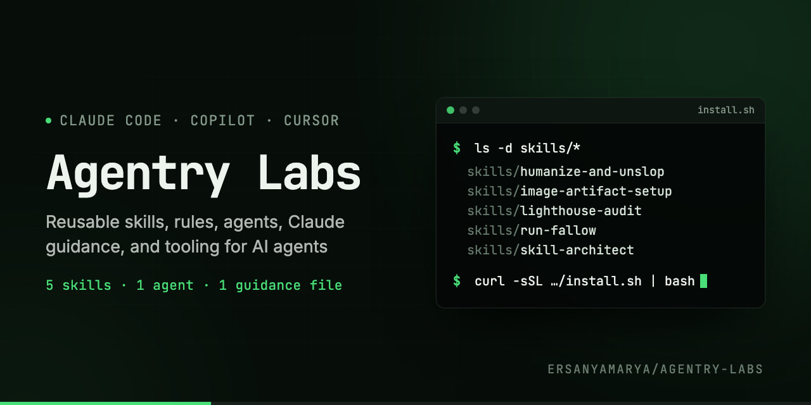

# Agentry Labs



Reusable skills, rules, agents, Claude guidance, and tooling for AI agents

## What is Agentry Labs?

A collection of framework-agnostic AI agent components — Claude Code skills and guidance files, GitHub Copilot agents, Cursor rules, and MCP configs. Designed for reuse across projects.

## Installation

### One-line Installer
```bash
curl -sSL https://raw.githubusercontent.com/ersanyamarya/agentry-labs/main/scripts/install.sh | bash
```

By default, the installer writes to `./.claude` in the current project. Pass
`--global` to write to `~/.claude` instead. The installer opens a chooser when
run in an interactive terminal; select a whole component type, an individual
component, or everything:

```bash
# See every available selector
./scripts/install.sh --list

# Install every skill and rule
./scripts/install.sh --type skills --type rules

# Install only one skill
./scripts/install.sh skills/run-fallow

# Install one skill globally
./scripts/install.sh --global skills/run-fallow

# Mix component types and individual components
./scripts/install.sh skills/run-fallow rules agents/super-planner.agent.md

# Install the basic Claude project guidance template
./scripts/install.sh claude-md-files/BASIC_CLAUDE.md

# Install everything into a custom agent directory
./scripts/install.sh --all --target "$HOME/.config/my-agent"

# Select components through the one-line installer
curl -sSL https://raw.githubusercontent.com/ersanyamarya/agentry-labs/main/scripts/install.sh | bash -s -- skills/run-fallow

# Install globally through the one-line installer
curl -sSL https://raw.githubusercontent.com/ersanyamarya/agentry-labs/main/scripts/install.sh | bash -s -- --global skills/run-fallow
```

Run `./scripts/install.sh --help` for all selectors, options, and examples.

### Manual Copy
1. Clone this repo
2. Copy skills to the current project's Claude Code directory:
   ```bash
   mkdir -p .claude/skills
   cp -r skills/* .claude/skills/
   ```

## Usage
1. Install skills
2. Invoke a skill by name in Claude Code, interactively or with `-p`. Skills also trigger on their own when a request matches their description.
   ```bash
   claude -p "/run-fallow"
   claude -p "/humanize-and-unslop README.md --detect"
   ```

## Available Components

### Skills (`.claude/skills/`)
| Skill | Description |
|-------|-------------|
| `image-artifact-setup` | Scaffold a reproducible image generator (OG cards, social previews, README banners) using Playwright, in any stack |
| `lighthouse-audit` | Run Lighthouse (mobile and desktop) on any web stack, trace findings to the source, and write a prioritized fix plan |
| `humanize-and-unslop` | Edit drafts into plain human writing while keeping the author's claims, or detect AI tells with line numbers |
| `run-fallow` | Run the `fallow` CLI on any JS/TS project for dead code, duplication, complexity, and security candidates |
| `skill-architect` | Create, improve, or review skills, validate them against the spec, and test them on a sample |

### Agents (`.claude/agents/`)
| Agent | Description |
|-------|-------------|
| `super-planner` | Investigate a task and produce a verified, execution-ready plan without making changes |

### Rules (`.claude/rules/`)
None published yet. The installer already accepts `rules` and `rules/<name>` selectors.

### Claude MD files (`.claude/claude-md-files/`)
| File | Description |
|------|-------------|
| `BASIC_CLAUDE.md` | Starting template for concise project-specific Claude Code guidance |

## Adding New Components
1. Fork this repo
2. Add your component to the appropriate directory
3. Submit a PR

## License
MIT